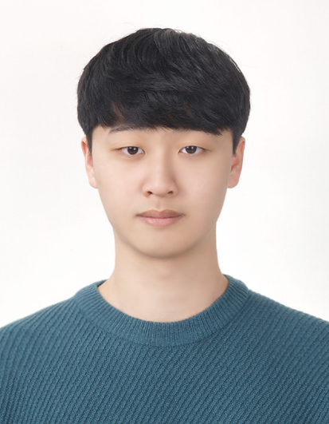

  <!-- Left Panel -->
  

    
    <h2 style="margin: 10px 0 4px;"><strong>Chanho Kim</strong></h2>
    
Combined M.S./Ph.D. Student

    
<a href="https://aigs.unist.ac.kr/">AIGS, UNIST</a>

    

      <!-- <a href="/assets/files/chanho_kim_cv.pdf"><strong>CV</strong></a> | -->
      <a href="https://linkedin.com/in/chanho-kim-891a542a2">LinkedIn</a> |
      <a href="https://github.com/coolho1129">GitHub</a>
    

  

  <!-- Right Panel -->
  

    <h3><strong>About Me</strong></h3>
    
I am a combined M.S./Ph.D. student at the
      <a href="https://aigs.unist.ac.kr/">Artificial Intelligence Graduate School (AIGS)</a>, UNIST.

      
      
I received my B.S. degree in Computer Science and Engineering from Kyungpook National University.

    
Currently, I am a member of the
      <a href="https://vision.unist.ac.kr">UNIST Vision and Learning Lab (UVLL)</a>,
      advised by <a href="https://sites.google.com/site/bsrvision00/">Prof. Seungryul Baek</a>.

    
My research interests include deep learning, computer vision, and vision-language models.

    <h3><strong>Contact</strong></h3>
    <ul style="list-style: none; padding-left: 0; line-height: 1.8; margin: 0 0 24px;">
      <li><strong>Email:</strong> <a href="mailto:coolho123@unist.ac.kr">coolho123@unist.ac.kr</a></li>
      <li><strong>Location:</strong> 50 UNIST-gil, Ulju, Ulsan, Republic of Korea</li>
    </ul>

    <h3><strong>Education</strong></h3>
    <ul style="list-style: none; padding-left: 0; line-height: 1.8;">
      <li style="margin-bottom: 12px;">
        <strong>M.S./Ph.D.</strong> in Artificial Intelligence, UNIST, Ulsan, South Korea  
        
Sep. 2025 – Present

      </li>
      <li>
        <strong>B.S.</strong> in Computer Science and Engineering,  
        Kyungpook National University, Daegu, South Korea  
        
Mar. 2021 – Feb. 2025

      </li>
    </ul>

  

